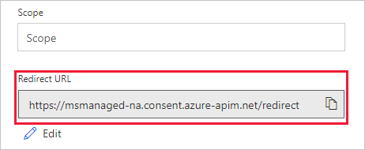
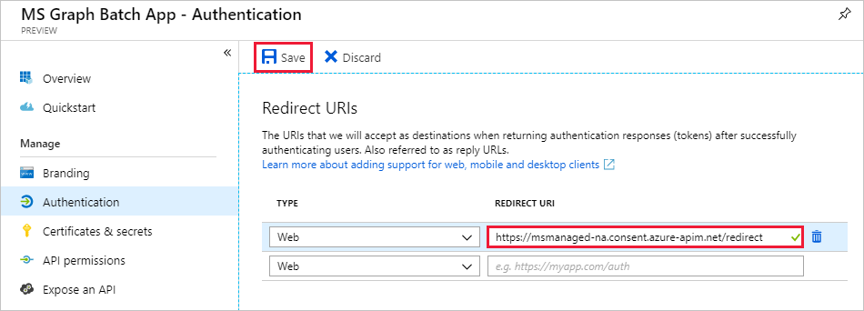

<!-- markdownlint-disable MD002 MD041 -->

En este ejercicio, creará un nuevo conector personalizado que se puede usar en flujo o en aplicaciones lógicas de Azure.In this exercise, you will create a new custom connector which can be used in Flow or in Azure Logic Apps. El archivo de definición de la API abierta se crea previamente con la ruta de acceso `$batch` correcta para el punto de conexión de Microsoft Graph y la configuración adicional para habilitar la importación simple.The Open API definition file is prebuilt with the correct path for the Microsoft Graph `$batch` endpoint and additional settings to enable simple import.

Con un editor de texto, cree un nuevo archivo vacío `MSGraph-Delegate-Batch.swagger.json` denominado y agregue el siguiente código.Using a text editor, create a new empty file named `MSGraph-Delegate-Batch.swagger.json` and add the following code.

[!code-json]

Abra un explorador y vaya a [Microsoft Flow](https://flow.microsoft.com).Open a browser and navigate to [Microsoft Flow](https://flow.microsoft.com). Inicie sesión con su cuenta de administrador de inquilinos de Office 365.Sign in with your Office 365 tenant administrator account. Elija el icono de engranaje en la esquina superior derecha y seleccione el elemento **conectores personalizados** en el menú desplegable.Choose the gear icon in the upper right, and select the **Custom Connectors** item in the drop-down menu.

En la página **conectores personalizados** , elija el vínculo **crear conector personalizado** en la parte superior derecha y, a continuación, seleccione el elemento **importar un archivo de la API abierta** en el menú desplegable.On the **Custom Connectors** page choose the **Create custom connector** link in the top right, then select the **Import an Open API file** item in the drop-down menu.

 

Escriba `MS Graph Batch Connector` en el cuadro de texto **nombre del conector personalizado** .Enter `MS Graph Batch Connector` in the **Custom connector name** text box. Elija el icono de carpeta para cargar el archivo de la API abierta.Choose the folder icon to upload the Open API file. Busque el `MSGraph-Delegate-Batch.swagger.json` archivo que ha creado.Browse to the `MSGraph-Delegate-Batch.swagger.json` file you created. Elija **continuar** para cargar el archivo de la API abierta.Choose **Continue** to upload the Open API file.

 

En la página Configuración del conector, elija el vínculo **seguridad** en el menú de navegación.On the connector configuration page, choose the **Security** link in the navigation menu. Rellene los campos como se indica a continuación.Fill in the fields as follows.

- **Elija qué autenticación implementa la API**:`OAuth 2.0`**Choose what authentication is implemented by your API**: `OAuth 2.0`
- **Proveedor de identidad**:`Azure Active Directory`**Identity Provider**: `Azure Active Directory`
- **Identificador de cliente**: identificador de la aplicación que creó en el ejercicio anterior.**Client id**: the application ID you created in the previous exercise
- **Secreto de cliente**: la clave que creó en el ejercicio anterior**Client secret**: the key you created in the previous exercise
- **Dirección URL de inicio de sesión**:`https://login.windows.net`**Login url**: `https://login.windows.net`
- **Identificador de inquilino**:`common`**Tenant ID**: `common`
- **Dirección URL**del `https://graph.microsoft.com` recurso: (sin finalización/)**Resource URL**: `https://graph.microsoft.com` (no trailing /)
- **Ámbito**: dejar en blanco**Scope**: Leave blank

Elija **crear conector** en la parte superior derechaChoose **Create Connector** on the top-right

Una vez creado el conector, copie la **dirección URL**de redireccionamiento generada.After the connector has been created, copy the generated **Redirect URL**.

Vuelva a la aplicación registrada en el [portal de Azure](https://aad.portal.azure.com) que creó en el ejercicio anterior.Go back to the registered application in the [Azure Portal](https://aad.portal.azure.com) you created in the previous exercise. Seleccione **información general** en la hoja **aplicación para lotes de MS Graph** y, a continuación, seleccione **Agregar un URI**de redireccionamiento.Select **Overview** on the **MS Graph Batch App** blade, then select **Add a Redirect URI**. Agregue la **URL** de redireccionamiento que ha copiado en el campo **URI** de redireccionamiento y elija **Guardar**.Add the **Redirect URL** you copied in the **Redirect URI** field and choose **Save**.

