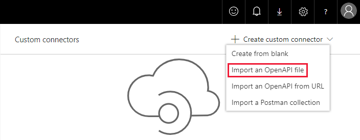
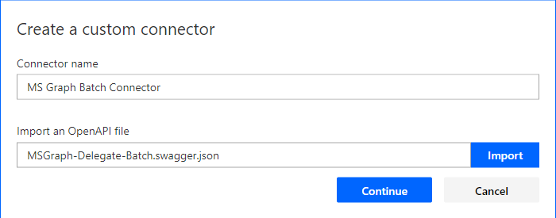

<!-- markdownlint-disable MD002 MD041 -->

En este ejercicio, creará un nuevo conector personalizado que se puede usar en flujo o en aplicaciones lógicas de Azure. El archivo de definición de la API abierta se crea previamente con la ruta de acceso `$batch` correcta para el punto de conexión de Microsoft Graph y la configuración adicional para habilitar la importación simple.

Con un editor de texto, cree un nuevo archivo vacío `MSGraph-Delegate-Batch.swagger.json` denominado y agregue el siguiente código.

[!code-json]

Abra un explorador y vaya a [Microsoft Flow](https://flow.microsoft.com). Inicie sesión con su cuenta de administrador de inquilinos de Office 365. Elija el icono de engranaje en la esquina superior derecha y seleccione el elemento **conectores personalizados** en el menú desplegable.

En la página **conectores personalizados** , elija el vínculo **crear conector personalizado** en la parte superior derecha y, a continuación, seleccione el elemento **importar un archivo de la API abierta** en el menú desplegable.

 

Escriba `MS Graph Batch Connector` en el cuadro de texto **nombre del conector personalizado** . Elija el icono de carpeta para cargar el archivo de la API abierta. Busque el `MSGraph-Delegate-Batch.swagger.json` archivo que ha creado. Elija **continuar** para cargar el archivo de la API abierta.

 

En la página Configuración del conector, elija el vínculo **seguridad** en el menú de navegación. ReLlene los campos como se indica a continuación.

- **Elija qué autenticación implementa la API**:`OAuth 2.0`
- **Proveedor de identidad**:`Azure Active Directory`
- **Identificador de cliente**: identificador de la aplicación que creó en el ejercicio anterior.
- **Secreto de cliente**: la clave que creó en el ejercicio anterior
- **Dirección URL de inicio de sesión**:`https://login.windows.net`
- **Identificador de inquilino**:`common`
- **Dirección URL**del `https://graph.microsoft.com` recurso: (sin finalización/)
- **Ámbito**: dejar en blanco

Elija **crear conector** en la parte superior derecha

Una vez creado el conector, copie la **dirección URL**de redireccionamiento generada.

Vuelva a la aplicación registrada en el [portal de Azure](https://aad.portal.azure.com) que creó en el ejercicio anterior. Seleccione **URL de respuesta** en la hoja de **configuración** . Agregue la **URL** de redireccionamiento que ha copiado como una **dirección URL de respuesta**adicional. Guarde la aplicación en el portal de Azure Active Directory.

