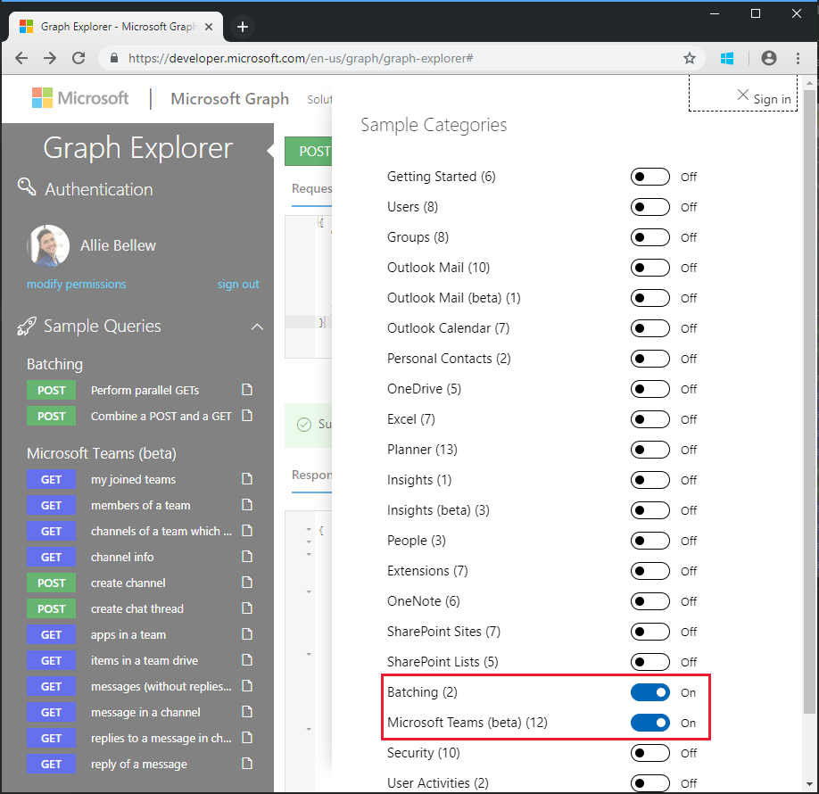
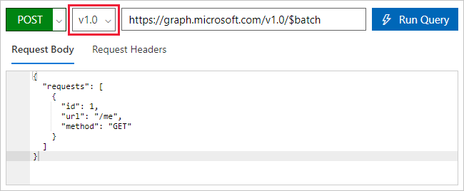
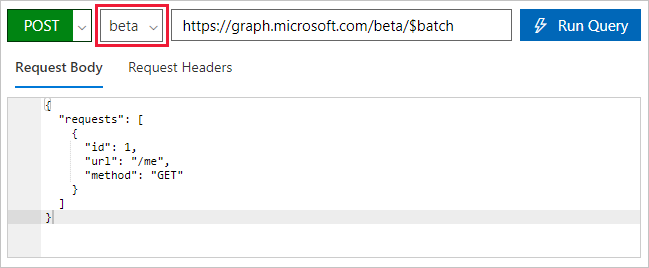

<!-- markdownlint-disable MD002 MD041 -->

<span data-ttu-id="94ef0-101">Antes de crear un flujo para usar el nuevo conector, use el [Explorador de Microsoft Graph](https://developer.microsoft.com/graph/graph-explorer) para descubrir algunas de las capacidades y características del procesamiento por lotes de JSON en Microsoft Graph.</span><span class="sxs-lookup"><span data-stu-id="94ef0-101">Before creating a Flow to consume the new connector, use [Microsoft Graph Explorer](https://developer.microsoft.com/graph/graph-explorer) to discover some of the capabilities and features of JSON batching in Microsoft Graph.</span></span>

<span data-ttu-id="94ef0-102">Abra el [Explorador de Microsoft Graph](https://developer.microsoft.com/graph/graph-explorer) en el explorador.</span><span class="sxs-lookup"><span data-stu-id="94ef0-102">Open the [Microsoft Graph Explorer](https://developer.microsoft.com/graph/graph-explorer) in your browser.</span></span> <span data-ttu-id="94ef0-103">Inicie sesión con su cuenta de administrador de inquilinos de Office 365.</span><span class="sxs-lookup"><span data-stu-id="94ef0-103">Sign in with your Office 365 tenant administrator account.</span></span> <span data-ttu-id="94ef0-104">Elija el vínculo **Mostrar más ejemplos** en el panel de navegación izquierdo y alterne los ejemplos para **procesamiento por lotes** y **Microsoft Teams (beta)** en **activado**.</span><span class="sxs-lookup"><span data-stu-id="94ef0-104">Choose the **show more samples** link in the left navigation pane, and toggle the samples for **Batching** and **Microsoft Teams (beta)** to **On**.</span></span>



<span data-ttu-id="94ef0-106">Seleccione la consulta realizar ejemplo de **Get Parallel** en el menú de la izquierda.</span><span class="sxs-lookup"><span data-stu-id="94ef0-106">Select the **Perform parallel GETs** sample query in the left menu.</span></span> <span data-ttu-id="94ef0-107">Elija el botón **Ejecutar consulta** en la parte superior derecha de la pantalla.</span><span class="sxs-lookup"><span data-stu-id="94ef0-107">Choose the **Run Query** button at the top right of the screen.</span></span>

<span data-ttu-id="94ef0-108">La operación por lotes de ejemplo procesa por lotes tres solicitudes HTTP GET y emite un solo HTTP `/v1.0/$batch` post al punto de conexión del grafo.</span><span class="sxs-lookup"><span data-stu-id="94ef0-108">The sample batch operation batches three HTTP GET requests and issues a single HTTP POST to the `/v1.0/$batch` Graph endpoint.</span></span>

```json
{
  "requests": [
    {
      "url": "/me?$select=displayName,jobTitle,userPrincipalName",
      "method": "GET",
      "id": "1"
    },
    {
      "url": "/me/messages?$filter=importance eq 'high'&$select=from,subject,receivedDateTime,bodyPreview",
      "method": "GET",
      "id": "2"
    },
    {
      "url": "/me/events",
      "method": "GET",
      "id": "3"
    }
  ]
}
```

<span data-ttu-id="94ef0-109">La respuesta devuelta se muestra a continuación.</span><span class="sxs-lookup"><span data-stu-id="94ef0-109">The response returned is shown below.</span></span> <span data-ttu-id="94ef0-110">Tenga en cuenta la matriz de respuestas que devuelve Microsoft Graph.</span><span class="sxs-lookup"><span data-stu-id="94ef0-110">Note the array of responses that is returned by Microsoft Graph.</span></span> <span data-ttu-id="94ef0-111">Las respuestas a las solicitudes por lotes pueden aparecer en un orden diferente que el orden de las solicitudes en la publicación.</span><span class="sxs-lookup"><span data-stu-id="94ef0-111">The responses to the batched requests may appear in a different order than the order of the requests in the POST.</span></span> <span data-ttu-id="94ef0-112">La `id` propiedad debe usarse para correlacionar solicitudes de lote individuales con respuestas de lotes específicas.</span><span class="sxs-lookup"><span data-stu-id="94ef0-112">The `id` property should be used to correlate individual batch requests with specific batch responses.</span></span>

> [!NOTE]
> <span data-ttu-id="94ef0-113">La respuesta se ha truncado para facilitar su lectura.</span><span class="sxs-lookup"><span data-stu-id="94ef0-113">The response has been truncated for readability.</span></span>

```json
{
  "responses": [
    {
      "id": "1",
      "status": 200,
      "headers": {...},
      "body": {...}
    },
    {
      "id": "3",
      "status": 200,
      "headers": {...},
      "body": {...}
    }
    {
      "id": "2",
      "status": 200,
      "headers": {...},
      "body": {...}
    }
  ]
}
```

<span data-ttu-id="94ef0-114">Cada respuesta contiene una `id`propiedad `status`, `headers`, y `body` .</span><span class="sxs-lookup"><span data-stu-id="94ef0-114">Each response contains an `id`, `status`, `headers`, and `body` property.</span></span> <span data-ttu-id="94ef0-115">Si la `status` propiedad de una solicitud indica un error, el `body` contiene cualquier información de error devuelta por la solicitud.</span><span class="sxs-lookup"><span data-stu-id="94ef0-115">If the `status` property for a request indicates a failure, the `body` contains any error information returned from the request.</span></span>

<span data-ttu-id="94ef0-116">Para garantizar un orden de operaciones para las solicitudes, las solicitudes individuales se pueden secuenciar mediante la propiedad [DEPENDSON](https://docs.microsoft.com/graph/json-batching#sequencing-requests-with-the-dependson-property) .</span><span class="sxs-lookup"><span data-stu-id="94ef0-116">To ensure an order of operations for the requests, individual requests can be sequenced using the [dependsOn](https://docs.microsoft.com/graph/json-batching#sequencing-requests-with-the-dependson-property) property.</span></span>

<span data-ttu-id="94ef0-117">Además de las operaciones de secuencia y dependencia, el procesamiento por lotes de JSON asume una ruta de acceso base y ejecuta las solicitudes de una ruta de acceso relativa.</span><span class="sxs-lookup"><span data-stu-id="94ef0-117">In addition to sequencing and dependency operations, JSON batching assumes a base path and executes the requests from a relative path.</span></span> <span data-ttu-id="94ef0-118">Cada elemento de solicitud de lote se ejecuta desde `/v1.0/$batch` los `/beta/$batch` extremos o como se especifique.</span><span class="sxs-lookup"><span data-stu-id="94ef0-118">Each batch request element is executed from either the `/v1.0/$batch` OR `/beta/$batch` endpoints as specified.</span></span> <span data-ttu-id="94ef0-119">Esto puede tener diferencias considerables porque `/beta` el extremo puede devolver un resultado adicional que no se puede devolver `/v1.0` en el punto de conexión.</span><span class="sxs-lookup"><span data-stu-id="94ef0-119">This can have significant differences as the `/beta` endpoint may return additional output which may NOT be returned in the `/v1.0` endpoint.</span></span>

<span data-ttu-id="94ef0-120">Por ejemplo, ejecute las dos consultas siguientes en el [probador de Microsoft Graph](https://developer.microsoft.com/graph/graph-explorer).</span><span class="sxs-lookup"><span data-stu-id="94ef0-120">For example, execute the following two queries in the [Microsoft Graph Explorer](https://developer.microsoft.com/graph/graph-explorer).</span></span>

1. <span data-ttu-id="94ef0-121">Consulte el `/v1.0/$batch` extremo mediante la dirección `/me` URL (solicitud de copiar y pegar a continuación).</span><span class="sxs-lookup"><span data-stu-id="94ef0-121">Query the `/v1.0/$batch` endpoint using the url `/me` (copy and paste request below).</span></span>

```json
{
  "requests": [
    {
      "id": 1,
      "url": "/me",
      "method": "GET"
    }
  ]
}
```



<span data-ttu-id="94ef0-123">Ahora, use el menú desplegable del selector de versiones para `beta` cambiar al punto de conexión y realice la misma solicitud exacta.</span><span class="sxs-lookup"><span data-stu-id="94ef0-123">Now use the version selector drop-down to change to the `beta` endpoint, and make the exact same request.</span></span>



<span data-ttu-id="94ef0-125">¿Cuáles son las diferencias en los resultados devueltos?</span><span class="sxs-lookup"><span data-stu-id="94ef0-125">What are the differences in the results returned?</span></span> <span data-ttu-id="94ef0-126">Pruebe otras consultas para identificar algunas de las diferencias.</span><span class="sxs-lookup"><span data-stu-id="94ef0-126">Try some other queries to identify some of the differences.</span></span>

<span data-ttu-id="94ef0-127">Además del contenido de la respuesta diferente de `/v1.0` los `/beta` puntos de conexión y, es importante comprender los posibles errores cuando se realiza una solicitud por lotes para la que no se ha concedido consentimiento para los permisos.</span><span class="sxs-lookup"><span data-stu-id="94ef0-127">In addition to different response content from the `/v1.0` and `/beta` endpoints, it is important to understand the possible errors when a batch request is made for which permission consent has not been granted.</span></span> <span data-ttu-id="94ef0-128">Por ejemplo, el siguiente es un elemento de solicitud por lotes para crear un bloc de notas de OneNote.</span><span class="sxs-lookup"><span data-stu-id="94ef0-128">For example, the following is a batch request item to create a OneNote Notebook.</span></span>

```json
{
  "id": 1,
  "url": "/groups/65c5ecf9-3311-449c-9904-29a2c76b9a50/onenote/notebooks",
  "headers": {
    "Content-Type": "application/json"
  },
  "method": "POST",
  "body": {
    "displayName": "Meeting Notes"
  }
}
```

<span data-ttu-id="94ef0-129">Sin embargo, si no se ha concedido el permiso para crear blocs de notas de OneNote, se recibirá la siguiente respuesta.</span><span class="sxs-lookup"><span data-stu-id="94ef0-129">However, if the permissions to create OneNote Notebooks has not been granted, the following response is received.</span></span> <span data-ttu-id="94ef0-130">Nota el código `403 (Forbidden)` de estado y el mensaje de error que indica el token de OAuth proporcionado no incluyen los ámbitos necesarios para completar la acción solicitada.</span><span class="sxs-lookup"><span data-stu-id="94ef0-130">Note the status code `403 (Forbidden)` and the error message which indicates the OAuth token provided does not include the scopes required to completed the requested action.</span></span>

```json
{
  "responses": [
    {
      "id": "1",
      "status": 403,
      "headers": {
        "Cache-Control": "no-cache"
      },
      "body": {
        "error": {
          "code": "40004",
          "message": "The OAuth token provided does not have the necessary scopes to complete the request.
            Please make sure you are including one or more of the following scopes: Notes.ReadWrite.All,
            Notes.Read.All (you provided these scopes: Group.Read.All,Group.ReadWrite.All,User.Read,User.Read.All)",
          "innerError": {
            "request-id": "92d50317-aa06-4bd7-b908-c85ee4eff0e9",
            "date": "2018-10-17T02:01:10"
          }
        }
      }
    }
  ]
}
```

<span data-ttu-id="94ef0-131">Cada solicitud del lote devolverá un código de estado y resultados o información de error.</span><span class="sxs-lookup"><span data-stu-id="94ef0-131">Each request in your batch will return a status code and results or error information.</span></span> <span data-ttu-id="94ef0-132">Debe procesar cada respuesta para determinar si se ha realizado correctamente o no el error de las operaciones por lotes individuales.</span><span class="sxs-lookup"><span data-stu-id="94ef0-132">You must process each of the responses in order to determine success or failure of the individual batch operations.</span></span>