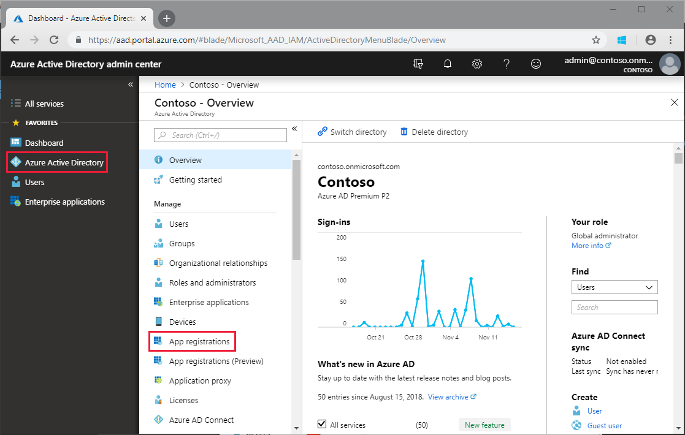
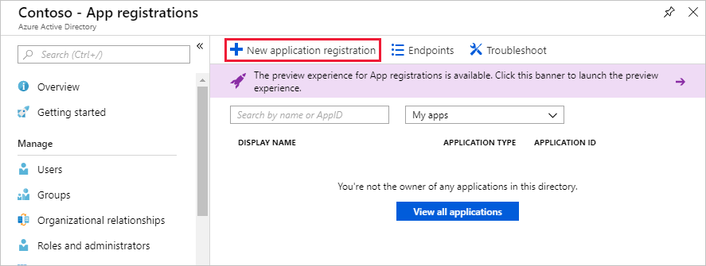
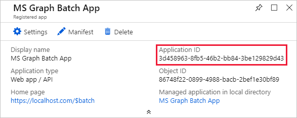
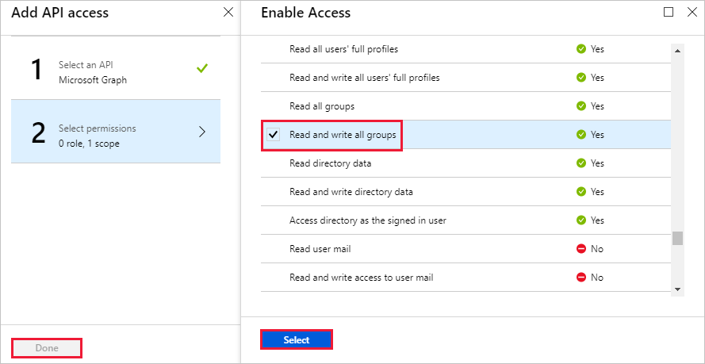

<!-- markdownlint-disable MD002 MD041 -->

En este ejercicio, creará una nueva aplicación de Azure Active Directory que se usará para proporcionar los permisos delegados para el conector personalizado.

Abra un explorador y vaya al [centro de administración de Azure Active Directory](https://aad.portal.azure.com). Elija el vínculo de **Azure Active Directory** en el menú de navegación de la izquierda y, después, elija la entrada **registros de aplicaciones** en la sección **administrar** de la hoja **Azure Active Directory** .

Elija el elemento de menú **registro de aplicaciones nuevo** en la parte superior de la hoja **registros** de aplicaciones.

Escriba `MS Graph Batch App` en el campo **nombre** y `https://localhost.com/$batch` , en el campo **dirección URL de inicio de sesión** , elija **crear**.

En la página **aplicación para lotes de MS Graph** , copie el **identificador de aplicación** de la aplicación. Lo necesitará en el siguiente ejercicio.

Elija el engranaje **configuración** en el nombre de la aplicación y luego elija el elemento de menú **permisos necesarios** en la hoja configuración. Elija **Agregar** en la parte superior de la hoja de **permisos necesarios** .

Seleccione la opción **seleccionar una API** en la hoja **Agregar API de acceso** y, a continuación, seleccione el elemento **Microsoft Graph** y elija **seleccionar** en la parte inferior de la hoja.

En la hoja **Habilitar acceso** , desplácese hacia abajo hasta la sección **permisos delegados** . Seleccione el permiso delegado **leer y escribir en todos los grupos** y, a continuación, elija **seleccionar** en la parte inferior de la hoja. Elija **hecho** en la parte inferior de la hoja **Agregar API de acceso** .

 

Elija el elemento de menú **claves** en la hoja **configuración** . Escriba `forever` en la **Descripción** de la clave y seleccione **nunca expira** en el menú desplegable **duración** . Elija **Guardar** en la parte superior de la hoja **claves** . Copie el valor clave de la nueva clave. Lo necesitará en el siguiente ejercicio.

> [!IMPORTANT]
> Este paso es crítico ya que no se podrá acceder a la clave una vez que cierre esta hoja. Guarde esta clave en un editor de texto para usarla en los ejercicios venideros.

Para habilitar la administración de servicios adicionales a los que se puede tener acceso a través de Microsoft Graph, incluidas las propiedades de Team, debe seleccionar ámbitos apropiados adicionales para habilitar la administración de servicios específicos. Por ejemplo, para ampliar nuestra solución para habilitar la creación de blocs de notas de OneNote o los planes de planeación, las tareas que necesitaría agregar los ámbitos de permisos necesarios para las API relevantes.
