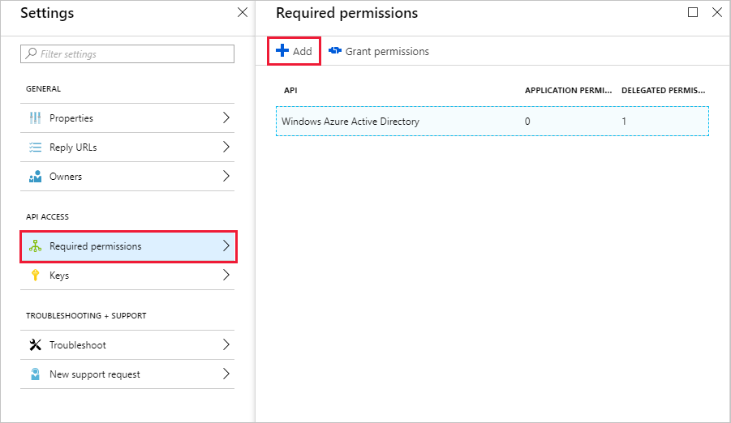
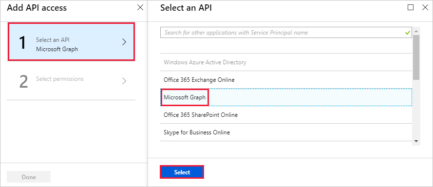
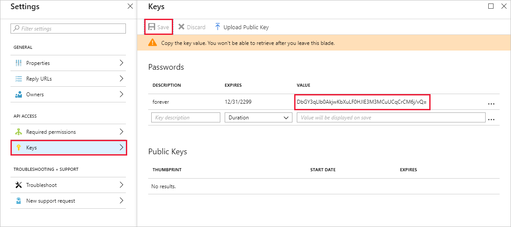

<!-- markdownlint-disable MD002 MD041 -->

En este ejercicio, creará una nueva aplicación de Azure Active Directory que se usará para proporcionar los permisos delegados para el conector personalizado.In this exercise, you will create a new Azure Active Directory Application which will be used to provide the delegated permissions for the custom connector.

Abra un explorador y vaya al [centro de administración de Azure Active Directory](https://aad.portal.azure.com).Open a browser and navigate to [Azure Active Directory admin center](https://aad.portal.azure.com). Elija el vínculo de **Azure Active Directory** en el menú de navegación de la izquierda y, después, elija la entrada **registros de aplicaciones** en la sección **administrar** de la hoja **Azure Active Directory** .Choose the **Azure Active Directory** link in the left navigation menu, then choose the **App registrations** entry in the **Manage** section of the **Azure Active Directory** blade.

Elija el elemento de menú **registro de aplicaciones nuevo** en la parte superior de la hoja **registros** de aplicaciones.Choose the **New application registration** menu item at the top of the **App Registrations** blade.

Escriba `MS Graph Batch App` en el campo **nombre** y `https://localhost.com/$batch` , en el campo **dirección URL de inicio de sesión** , elija **crear**.Enter `MS Graph Batch App` in the **Name** field, and `https://localhost.com/$batch` in the **Sign-on URL** field and choose **Create**.

En la página **aplicación para lotes de MS Graph** , copie el **identificador de aplicación** de la aplicación.On the **MS Graph Batch App** page, copy the **Application ID** of the application. Lo necesitará en el siguiente ejercicio.You'll need this in the next exercise.

Elija el engranaje **configuración** en el nombre de la aplicación y luego elija el elemento de menú **permisos necesarios** en la hoja configuración.Choose the **Settings** gear under the application name, then choose the **Required Permissions** menu item in the Settings blade. Elija **Agregar** en la parte superior de la hoja de **permisos necesarios** .Choose **Add** at the top of the **Required Permissions** blade.

Seleccione la opción **seleccionar una API** en la hoja **Agregar API de acceso** y, a continuación, seleccione el elemento **Microsoft Graph** y elija **seleccionar** en la parte inferior de la hoja.Choose the **Select an API** option in the **Add API access** blade, then select the **Microsoft Graph** item and choose **Select** at the bottom of the blade.

En la hoja **Habilitar acceso** , desplácese hacia abajo hasta la sección **permisos** delegados.On the **Enable Access** blade, scroll down to the **Delegated Permissions** section. Seleccione el permiso delegado **leer y escribir en todos los grupos** y, a continuación, elija **seleccionar** en la parte inferior de la hoja.Select the **Read and write all groups** delegated permission, then choose **Select** at the bottom of the blade. Elija **hecho** en la parte inferior de la hoja **Agregar API de acceso** .Choose **Done** at the bottom of the **Add API access** blade.

 

Elija el elemento de menú **claves** en la hoja **configuración** .Choose the **Keys** menu item on the **Settings** blade. Escriba `forever` en la **Descripción** de la clave y seleccione **nunca expira** en el menú desplegable **duración** .Enter `forever` in the **Key description** and select **Never expires** from the **Duration** drop down menu. Elija **Guardar** en la parte superior de la hoja **claves** .Choose **Save** at the top of the **Keys** blade. Copie el valor clave de la nueva clave.Copy the key value for the new key. Lo necesitará en el siguiente ejercicio.You'll need this in the next exercise.

> [!IMPORTANT]
> Este paso es crítico ya que no se podrá acceder a la clave una vez que cierre esta hoja.This step is critical as the key will not be accessible once you close this blade. Guarde esta clave en un editor de texto para usarla en los ejercicios venideros.Save this key to a text editor for use in upcoming exercises.

Para habilitar la administración de servicios adicionales a los que se puede tener acceso a través de Microsoft Graph, incluidas las propiedades de Team, debe seleccionar ámbitos apropiados adicionales para habilitar la administración de servicios específicos.To enable management of additional services accessible via the Microsoft Graph, including Teams properties, you would need to select additional, appropriate scopes to enable managing specific services. Por ejemplo, para ampliar nuestra solución para habilitar la creación de blocs de notas de OneNote o los planes de planeación, las tareas que necesitaría agregar los ámbitos de permisos necesarios para las API relevantes.For example, to extend our solution to enable creating OneNote Notebooks or Planner plans, buckets and tasks you would need to add the required permission scopes for the relevant APIs.